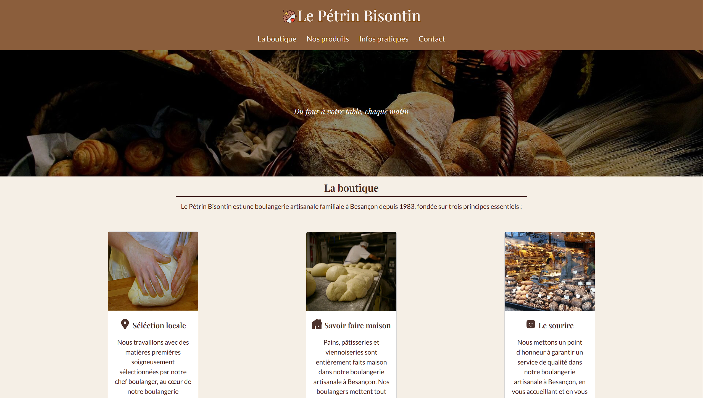

# One Page Artisan – Squelette de site vitrine

## 🧩 Introduction

Ce projet est un squelette de site one page destiné aux artisans. Il a pour objectif de servir de base rapide et adaptable pour la création de sites vitrines simples, modernes et efficaces. Pensé comme un exemple livrable rapidement, ce repository peut être facilement modifié afin de correspondre à différents corps de métier (plombier, électricien, menuisier, etc.) et à diverses identités visuelles.

## 🛠️ Choix techniques

Le projet repose sur des technologies volontairement simples et accessibles.

HTML / CSS sont utilisés pour la structure et le style, adaptés à un projet léger et facilement maintenable.

JavaScript apporte le dynamisme nécessaire, notamment pour :

- le menu burger (navigation responsive),

- un formulaire de contact simulant une validation côté client ainsi qu’un envoi fictif.

- La modale d'information de  cookie

Bootstrap est intégré afin de faciliter la création de composants UI réutilisables, comme le carousel, et d’assurer une mise en page responsive rapidement.

## 🚀 Démarrer le projet

Pour utiliser ce projet en local, il suffit de cloner le repository :

git clone https://github.com/votre-utilisateur/nom-du-repo.git

Une fois le projet cloné, ouvrez simplement le fichier index.html dans votre navigateur. Le site est prêt à être personnalisé selon les besoins de l’artisan (contenu, couleurs, images, sections, etc.).